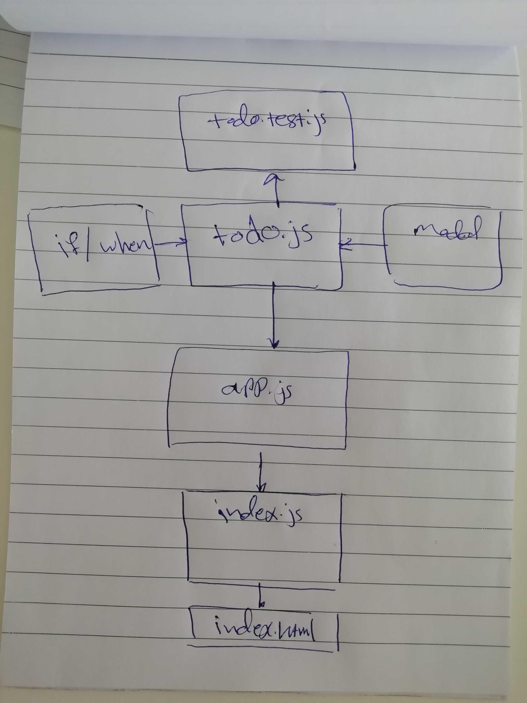

# LAB - Class 31

## Project Name

### Author: Student/Group Name

### Links and Resources

- [submission PR](https://github.com/naseem-401-advanced-javascript/lab-31/pull/1)
- [ci/cd](https://github.com/naseem-401-advanced-javascript/lab-31/actions) (GitHub Actions)

### Setup

#### How to initialize/run your application (where applicable)

- `npm run start`

#### Tests

- How do you run tests?
- `npm run test`

#### UML

